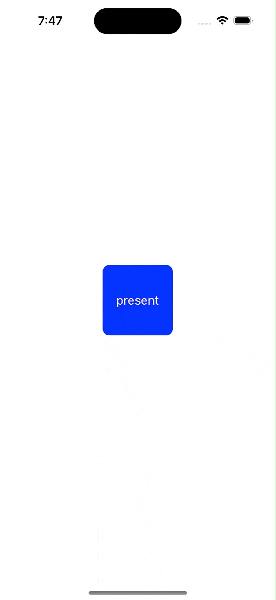
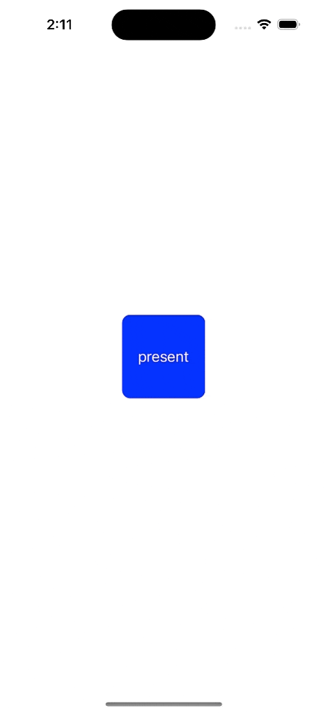
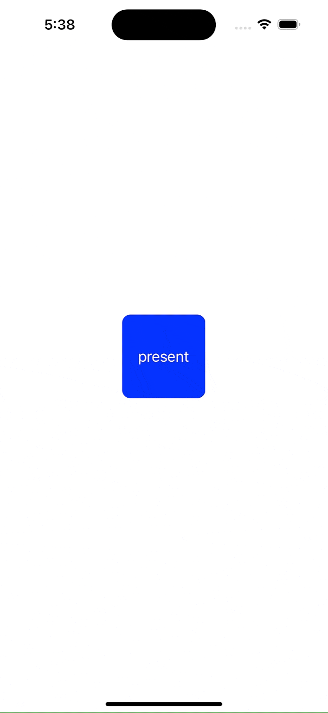
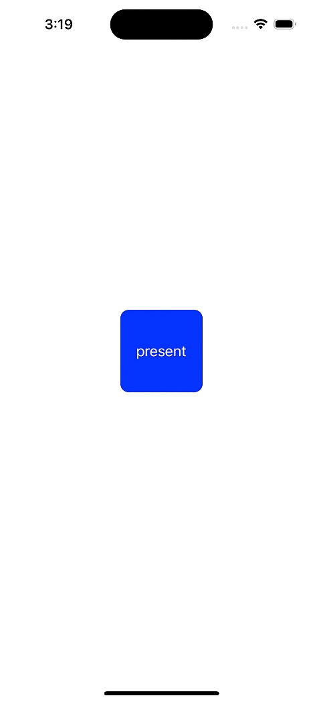

# 从相册App优雅的浅谈iOS转场动画

[TOC]

## iOS动画简介

&emsp;在iOS中在进行页面转场时候有很多的方式，可以通过present的方式直接进行模态的页面转场，也可通过将页面通过NavigationController去管理，进行页面转场，在默认的情况下，iOS为这些动画都制作了比较优雅的动画，但是在某些时候，为了使动画更加优雅，我们就需要对具体的动画进行重构，以达到我们想要达到的表现形式。

## 各类动画基础实现形式

- **model转场的基础实现形式**

  这种转场方式的实现在代码层面上是比较简单，我们只需要去写的页面使用present和dismiss即可进行跳转，具体实现效果如下：

  

  图中展示的是点击按钮以modal的方式进行转场，进入到下一个页面，然后下一个页面进行下滑操作回到上一个页面，当然这种方式不是唯一的返回页面的方法，而且需要我们去拖动页面来返回，不够优雅，所以在这个demo中，我将第二个页面做了一个按钮进行返回页面的操作，按下按钮即可触发，如下为两个页面的具体代码。

    ```swift
    //
    //  ViewController.swift
    //  ModalTransition
    //
    //  Created by hq on 2022/9/22.
    //

    import UIKit

    class ViewController: UIViewController {

        private var presentButton = UIButton()

        override func viewDidLoad() {
            super.viewDidLoad()
            // Do any additional setup after loading the view.
            setupPresentButton()
        }


    }

    private extension ViewController {

        func setupPresentButton() {
            view.addSubview(presentButton)
            presentButton.frame.size = CGSize(width: 100, height: 100)
            presentButton.setTitle("present", for: .normal)
            presentButton.center = view.center
            presentButton.backgroundColor = .blue
            presentButton.layer.cornerRadius = 10
            presentButton.addTarget(self, action: #selector(pressPresentButtonAction), for: .touchUpInside)
        }

        @objc func pressPresentButtonAction() {
            let toVC = SecondViewController()
            present(toVC, animated: true)
        }
    }
    ```

    ```swift
    //
    //  SecondViewController.swift
    //  ModalTransition
    //
    //  Created by hq on 2022/9/22.
    //

    import UIKit

    class SecondViewController: UIViewController {

        private var showLabel = UILabel()
        private var dismissButtton = UIButton()

        override func viewDidLoad() {
            super.viewDidLoad()

            // Do any additional setup after loading the view.
            view.backgroundColor = .white
            setupShowLabel()
            setupdismissButton()
        }
    }

    private extension SecondViewController {

        func setupShowLabel() {
            view.addSubview(showLabel)
            showLabel.frame.size = CGSize(width: 200, height: 50)
            showLabel.center = view.center
            showLabel.text = "这是第二个页面"
            showLabel.textAlignment = .center
            showLabel.backgroundColor = .orange
        }

        func setupdismissButton() {
            view.addSubview(dismissButtton)
            dismissButtton.frame.size = CGSize(width: 100, height: 100)
            dismissButtton.center = CGPoint(x: view.center.x, y: view.center.y + 80)
            dismissButtton.setTitle("dismiss", for: .normal)
            dismissButtton.backgroundColor = .black
            dismissButtton.addTarget(self, action: #selector(pressDissmissButtonAction), for: .touchUpInside)
        }

        @objc func pressDissmissButtonAction() {
            dismiss(animated: true)
        }
    }

    ```

    ```swift
    //
    //  SecondViewController.swift
    //  PracticeNavigationController
    //
    //  Created by hq on 2022/9/23.
    //


    import UIKit

    class SecondViewController: UIViewController {

        private var showLabel = UILabel()
        private var dismissButtton = UIButton()

        override func viewDidLoad() {
            super.viewDidLoad()

            // Do any additional setup after loading the view.
            view.backgroundColor = .white
            setupShowLabel()
            setupdismissButton()
        }
    }

    private extension SecondViewController {

        func setupShowLabel() {
            view.addSubview(showLabel)
            showLabel.frame.size = CGSize(width: 200, height: 50)
            showLabel.center = view.center
            showLabel.text = "这是第二个页面"
            showLabel.textAlignment = .center
            showLabel.backgroundColor = .orange
        }

        func setupdismissButton() {
            view.addSubview(dismissButtton)
            dismissButtton.frame.size = CGSize(width: 100, height: 100)
            dismissButtton.center = CGPoint(x: view.center.x, y: view.center.y + 80)
            dismissButtton.setTitle("dismiss", for: .normal)
            dismissButtton.backgroundColor = .black
            dismissButtton.addTarget(self, action: #selector(pressDissmissButtonAction), for: .touchUpInside)
        }

        @objc func pressDissmissButtonAction() {
            self.navigationController?.popViewController(animated: true)
        }
    }

    ```

- **使用UINavigationController来实现页面转场**

  当需要使用到UINavigationController来进行页面转场时，首先我们得先有一个UINavigationController我们才可以通过此方法去进行页面跳转，目前我们创建的项目都是基于storyboard创建的，所以我们加上NavigationController是非常简单的，只需要在storyboard中添加使用即可，具体实现如下：
  
  
  
  在代码中和上面一样我们写两个简单的页面来完成这个动画，在NavigationController中如果我们默认使用的话，会在左上角出现一个小箭头的标志，可以返回上一个页面，但是如果我们后续开发时候不想要那个小箭头或者想要点击另外一个位置返回页面，这个简单的功能就不能满足我们的需求了，不够优雅，所以我们和上面模态动画一样加一个按钮来模拟上面的情况，所以在demo中点击按钮也是可以正常返回上一级页面的，具体两个VC代码如下：
  
    ```swift
    //
    //  ViewController.swift
    //  PracticeNavigationController
    //
    //  Created by hq on 2022/9/23.
    //

    import UIKit

    class ViewController: UIViewController {

        private var jumpToSecondVCButton = UIButton()

        override func viewDidLoad() {
            super.viewDidLoad()
            // Do any additional setup after loading the view.
            setupPresentButton()
        }

        func setupPresentButton() {
            view.addSubview(jumpToSecondVCButton)
            jumpToSecondVCButton.frame.size = CGSize(width: 100, height: 100)
            jumpToSecondVCButton.setTitle("present", for: .normal)
            jumpToSecondVCButton.center = view.center
            jumpToSecondVCButton.backgroundColor = .blue
            jumpToSecondVCButton.layer.cornerRadius = 10
            jumpToSecondVCButton.addTarget(self, action: #selector(pressPresentButtonAction), for: .touchUpInside)
        }

        @objc func pressPresentButtonAction() {
            let toVC = SecondViewController()
            self.navigationController?.pushViewController(toVC, animated: true)
        }

    }

    ```

## 自定义转场动画

&emsp;上面描述的两种页面跳转的方式从代码中可以看出来，如果我们选择animated是true的话，他就会以一个默认的动画进行转场，虽然默认动画也比较漂亮，但是看多了总归会有审美疲劳，而且在某些特定场景中不够优雅的演示动画，所以我们就需要去重构这两种动画，下面将会由上述介绍的两种动画为例来重构转场动画。

- **Modal转场动画重构**

  对于动画进行重写时候我们就必须知道一个协议，那就是控制页面动画的协议UIViewControllerAnimatedTransitioning在这个协议中我们需要实现我们想要设置的动画效果，这里以不透明度的动画效果为例说明一下，当我点击页面时候另外一个页面会有不透明的变化的一个效果，具体实现效果如下：

  

  展示的是模态动画的操作，在具体实现动画时候，我们需要清楚模态动画结束之后，其实是一个VC显示在了另一个VC之上，所以在重写模态动画的时候，在present动画时候我们需要将第二个页面以全屏的方式显示在第一个页面之上，所以无论我们要进行什么转场动画的操作，我们最后都需要将第一个页面在动画的回调函数中复原；在dismiss动画时候，我们只需要把第二个页面上面展示的东西按照需要的动画方式消失掉就可以。本片博文中，以渐变动画为例介绍如何重写模态的转场动画，具体的动画文件和两个VC的文件如下：

    ```swift
    //
    //  AnimationTransition.swift
    //  ModalTransition
    //
    //  Created by hq on 2022/9/23.
    //

    import UIKit

    class AnimationTransition: NSObject {

        private var checkPresentOrDismiss = true

        init(checkPresentOrDismiss: Bool) {
            self.checkPresentOrDismiss = checkPresentOrDismiss
            super.init()
        }

    }

    extension AnimationTransition: UIViewControllerAnimatedTransitioning {
        func transitionDuration(using transitionContext: UIViewControllerContextTransitioning?) -> TimeInterval {
            return 0.5
        }

        func animateTransition(using transitionContext: UIViewControllerContextTransitioning) {
            if checkPresentOrDismiss {
                animateForPresent(using: transitionContext)
            } else {
                animateForDismiss(using: transitionContext)
            }
        }

        func animateForPresent(using transitionContext: UIViewControllerContextTransitioning) {
            guard let fromVC = transitionContext.viewController(forKey: .from) else { return }
            guard let fromVCView = fromVC.view else { return }
            guard let snapShotFromVC = fromVCView.snapshotView(afterScreenUpdates: true) else { return }
            guard let toVC = transitionContext.viewController(forKey: .to) else { return }
            guard let toVCView = toVC.view else { return }
            guard let snapShotToVC = toVCView.snapshotView(afterScreenUpdates: true) else { return }
            let containerView = transitionContext.containerView
            containerView.addSubview(snapShotToVC)
            containerView.addSubview(snapShotFromVC)
            containerView.addSubview(toVCView)
            toVCView.isHidden = true
            fromVCView.isHidden = true
            snapShotToVC.alpha = 0.0
            snapShotFromVC.alpha = 1.0

            UIView.animate(withDuration: 0.5, animations: {
                snapShotToVC.alpha = 1.0
                snapShotFromVC.alpha = 0.0
            }, completion: { (complete) in
                snapShotFromVC.removeFromSuperview()
                snapShotToVC.removeFromSuperview()
                toVCView.isHidden = false
                fromVCView.isHidden = false
                transitionContext.completeTransition(complete)
            })
        }

        func animateForDismiss(using transitionContext: UIViewControllerContextTransitioning) {
            guard let fromVC = transitionContext.viewController(forKey: .from) else { return }
            guard let fromVCView = fromVC.view else { return }
            guard let snapShotFromVC = fromVCView.snapshotView(afterScreenUpdates: true) else { return }
            guard let toVC = transitionContext.viewController(forKey: .to) else { return }
            guard let toVCView = toVC.view else { return }
            guard let snapShotToVC = toVCView.snapshotView(afterScreenUpdates: true) else { return }
            let containerView = transitionContext.containerView
            containerView.addSubview(snapShotToVC)
            containerView.addSubview(snapShotFromVC)
            snapShotToVC.alpha = 0.0
            snapShotFromVC.alpha = 1.0
            toVCView.isHidden = true
            fromVCView.isHidden = true

            UIView.animate(withDuration: 0.5, animations: {
                snapShotToVC.alpha = 1.0
                snapShotFromVC.alpha = 0.0
            }, completion: { (complete) in
                snapShotFromVC.removeFromSuperview()
                snapShotToVC.removeFromSuperview()
                toVCView.isHidden = false
                transitionContext.completeTransition(complete)
            })
        }
    }

    ```

    ```swift
    //
    //  ViewController.swift
    //  ModalTransition
    //
    //  Created by hq on 2022/9/22.
    //

    import UIKit

    class ViewController: UIViewController {

        private var presentButton = UIButton()

        override func viewDidLoad() {
            super.viewDidLoad()
            // Do any additional setup after loading the view.
            setupPresentButton()
        }


    }

    private extension ViewController {

        func setupPresentButton() {
            view.addSubview(presentButton)
            presentButton.frame.size = CGSize(width: 100, height: 100)
            presentButton.setTitle("present", for: .normal)
            presentButton.center = view.center
            presentButton.backgroundColor = .blue
            presentButton.layer.cornerRadius = 10
            presentButton.addTarget(self, action: #selector(pressPresentButtonAction), for: .touchUpInside)
        }

        @objc func pressPresentButtonAction() {
            let toVC = SecondViewController()
            toVC.modalPresentationStyle = .overFullScreen
            toVC.transitioningDelegate = self
            present(toVC, animated: true)
        }
    }

    extension ViewController: UIViewControllerTransitioningDelegate {
        func animationController(forPresented presented: UIViewController, presenting: UIViewController, source: UIViewController) -> UIViewControllerAnimatedTransitioning? {
            return AnimationTransition(checkPresentOrDismiss: true)
        }

        func animationController(forDismissed dismissed: UIViewController) -> UIViewControllerAnimatedTransitioning? {
            return AnimationTransition(checkPresentOrDismiss: false)
        }
    }

    ```

    ```swift
    //
    //  SecondViewController.swift
    //  ModalTransition
    //
    //  Created by hq on 2022/9/22.
    //

    import UIKit

    class SecondViewController: UIViewController {

        private var showLabel = UILabel()
        private var dismissButtton = UIButton()

        override func viewDidLoad() {
            super.viewDidLoad()
            // Do any additional setup after loading the view.
            view.backgroundColor = .white
            setupShowLabel()
            setupdismissButton()
        }
    }

    private extension SecondViewController {

        func setupShowLabel() {
            view.addSubview(showLabel)
            showLabel.frame.size = CGSize(width: 200, height: 50)
            showLabel.center = view.center
            showLabel.text = "这是第二个页面"
            showLabel.textAlignment = .center
            showLabel.backgroundColor = .orange
        }

        func setupdismissButton() {
            view.addSubview(dismissButtton)
            dismissButtton.frame.size = CGSize(width: 100, height: 100)
            dismissButtton.center = CGPoint(x: view.center.x, y: view.center.y + 80)
            dismissButtton.setTitle("dismiss", for: .normal)
            dismissButtton.backgroundColor = .black
            dismissButtton.addTarget(self, action: #selector(pressDissmissButtonAction), for: .touchUpInside)
        }

        @objc func pressDissmissButtonAction() {
            dismiss(animated: true, completion: nil)
        }
    }

    ```

- **UINavigationController转场动画重构**

  如上所说，使用 navigation controller 的方式在进行转场动画的时候也需要遵循UIViewControllerAnimatedTransitioning协议，但是在写动画的时候需要注意和模态动画不太一样的点是，使用 navigation controller 时候，页面进出场的方式是通过栈去控制的，所以不存在一个VC在另一个VC之上的情况，所以如果只是简单的渐变转场的动画，可以通用一个动画来完成。
  以渐变转场的动画为例，在完成此转场的转场动画时候，我们的思路是只需要写上前一个页面的view和后一个页面的view的不透明度进行变化即可思路也比较简单，具体实现效果以及源代码如下：

  

    ```swift
    //
    //  AnimationTransition.swift
    //  PracticeNavigationController
    //
    //  Created by hq on 2022/9/24.
    //


    import UIKit

    class AnimationTransition: NSObject {

        private var checkPresentOrDismiss = true

        init(checkPresentOrDismiss: Bool) {
            self.checkPresentOrDismiss = checkPresentOrDismiss
            super.init()
        }

    }

    extension AnimationTransition: UIViewControllerAnimatedTransitioning {
        func transitionDuration(using transitionContext: UIViewControllerContextTransitioning?) -> TimeInterval {
            return 0.5
        }

        func animateTransition(using transitionContext: UIViewControllerContextTransitioning) {
            animateForGradient(using: transitionContext)
        }

        func animateForGradient(using transitionContext: UIViewControllerContextTransitioning) {
            guard let fromVC = transitionContext.viewController(forKey: .from) else { return }
            guard let fromVCView = fromVC.view else { return }
            guard let toVC = transitionContext.viewController(forKey: .to) else { return }
            guard let toVCView = toVC.view else { return }
            let containerView = transitionContext.containerView
            containerView.addSubview(fromVCView)
            containerView.addSubview(toVCView)
            toVCView.alpha = 0.0
            fromVCView.alpha = 1.0

            UIView.animate(withDuration: 0.5, animations: {
                fromVCView.alpha = 0.0
                toVCView.alpha = 1.0
            }, completion: { (complete) in
                toVCView.isHidden = false
                fromVCView.isHidden = false
                transitionContext.completeTransition(complete)
            })
        }
    }

    ```

    ```swift
    //
    //  ViewController.swift
    //  PracticeNavigationController
    //
    //  Created by hq on 2022/9/23.
    //

    import UIKit

    class ViewController: UIViewController {

        private var jumpToSecondVCButton = UIButton()

        override func viewDidLoad() {
            super.viewDidLoad()
            // Do any additional setup after loading the view.
            setupPresentButton()
        }

        func setupPresentButton() {
            view.addSubview(jumpToSecondVCButton)
            jumpToSecondVCButton.frame.size = CGSize(width: 100, height: 100)
            jumpToSecondVCButton.setTitle("present", for: .normal)
            jumpToSecondVCButton.center = view.center
            jumpToSecondVCButton.backgroundColor = .blue
            jumpToSecondVCButton.layer.cornerRadius = 10
            jumpToSecondVCButton.addTarget(self, action: #selector(pressPresentButtonAction), for: .touchUpInside)
        }

        @objc func pressPresentButtonAction() {
            let toVC = SecondViewController()
            self.navigationController?.delegate = self
            self.navigationController?.pushViewController(toVC, animated: true)
        }

    }

    extension ViewController: UINavigationControllerDelegate {
        func navigationController(_ navigationController: UINavigationController, animationControllerFor operation: UINavigationController.Operation, from fromVC: UIViewController, to toVC: UIViewController) -> UIViewControllerAnimatedTransitioning? {

            if operation == .push {
                return AnimationTransition(checkPresentOrDismiss: true)
            }
            return AnimationTransition(checkPresentOrDismiss: false)
        }
    }
    ```

    ```swift
    //
    //  SecondViewController.swift
    //  PracticeNavigationController
    //
    //  Created by hq on 2022/9/23.
    //


    import UIKit

    class SecondViewController: UIViewController {

        private var showLabel = UILabel()
        private var dismissButtton = UIButton()

        override func viewDidLoad() {
            super.viewDidLoad()

            // Do any additional setup after loading the view.
            view.backgroundColor = .white
            setupShowLabel()
            setupdismissButton()
        }
    }

    private extension SecondViewController {

        func setupShowLabel() {
            view.addSubview(showLabel)
            showLabel.frame.size = CGSize(width: 200, height: 50)
            showLabel.center = view.center
            showLabel.text = "这是第二个页面"
            showLabel.textAlignment = .center
            showLabel.backgroundColor = .orange
        }

        func setupdismissButton() {
            view.addSubview(dismissButtton)
            dismissButtton.frame.size = CGSize(width: 100, height: 100)
            dismissButtton.center = CGPoint(x: view.center.x, y: view.center.y + 80)
            dismissButtton.setTitle("dismiss", for: .normal)
            dismissButtton.backgroundColor = .black
            dismissButtton.addTarget(self, action: #selector(pressDissmissButtonAction), for: .touchUpInside)
        }

        @objc func pressDissmissButtonAction() {
            self.navigationController?.popViewController(animated: true)
        }
    }

    ```

- **对比总结**

  先对比一下模态转场中重构之前和重构之后的动画实现
   
  通过对动画的重构从动画以及结果上来看已经完全看不到标准的模态动画的样式了，使用navigation controller 控制转场的动画就不继续对比了，表现形式和这个一致。
  所以当我们学会了如何去重置转场动画之后，我们就可以通过自己的需求去重构动画，使页面显示的更加优雅，极大的提高了我们在使用软件的视觉观感与舒适度。

## 注意事项

- 无论是使用哪种动画方式去进行页面跳转他都有一个共同点就是，所有的动画效果需要在transition中的containerView去完成，在delegate中操作时候返回nil就是返回的默认动画，如果没有规范的按照模态转场动画和 navigation controller 转场动画去重构动画，可能会出现使用默认动画时候表现形式报错，比如在使用present时候把前一个页面隐藏了，使用默认的进行返回时候，会直接返回一个黑屏，打开debug会发现此时页面上什么也没有。
- 在一个VC中我们在写一个动画时候往往不用过多的操作，但是在写VC之间的转场动画时候，我们必须写上完成动画之后的回调，在回调中加上动画效果已完成的操作，不加的话会出现完成过场动画之后第二个页面无法操作的情况。
